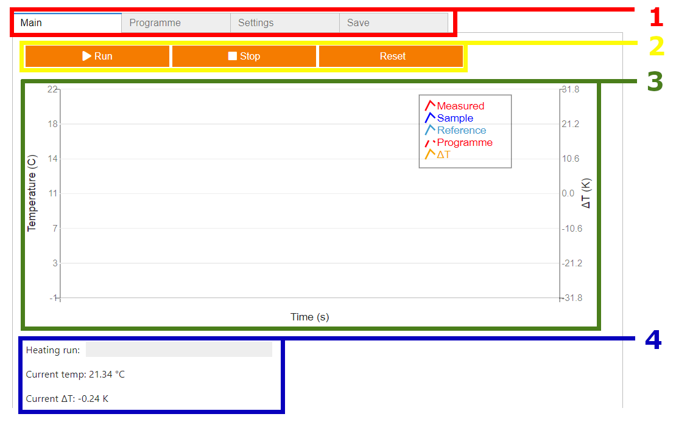

Basic Usage
===========

.. _web_app:

Background
------------

The user interface for the system is built using the `Jupyter Widgets <https://ipywidgets.readthedocs.io/en/stable/>`_ 
interactive browser controls for `Jupyter notebooks <https://jupyter.org/>`_, using `voila <https://voila.readthedocs.io/en/stable/index.html>`_
to render the notebook as a web application. More details on this can be found in the :doc:`software` section.

This automatically launches within the web browser, presenting the user interface on the touchscreen display.

.. _web_interface:

User Interface
--------------

The user interface is presented as a series of navigable tabs:

+---------------------------------------------------+---------------------------------------------------+
|                                                   |                                                   |
| .. figure:: ../images/UserInterfaceMain.png       | .. figure:: ../images/UserInterfaceProgramme.png  |
|     :align: center                                |       :align: center                              |
|     :scale: 50%                                   |       :scale: 50%                                 |
|     :alt: Web app interface                       |       :alt: Web app interface                     |
|                                                   |                                                   |
|     **Main page**                                 |       **Programme page**                          |
+---------------------------------------------------+---------------------------------------------------+
|                                                   |                                                   |     
| .. figure:: ../images/UserInterfaceSettings.png   | .. figure:: ../images/UserInterfaceExport.png     |
|       :align: center                              |       :align: center                              |
|       :scale: 50%                                 |       :scale: 50%                                 |
|       :alt: Web app interface                     |       :alt: Web app interface                     |
|                                                   |                                                   |
|       **Settings page**                           |       **Export page**                             |
+---------------------------------------------------+---------------------------------------------------+

.. _web_interface_main:

Main page
^^^^^^^^^

The main page features the 

1. Nagivation bar, for switching between the user interface pages
2. Control bar - 
3. Activity graph
4. Information bar

..
   Creating recipes
   ----------------
   
   To retrieve a list of random ingredients,
   you can use the ``lumache.get_random_ingredients()`` function:
   
   .. autofunction:: lumache.get_random_ingredients
   
   The ``kind`` parameter should be either ``"meat"``, ``"fish"``,
   or ``"veggies"``. Otherwise, :autofunction`lumache.get_random_ingredients`
   will raise an exception.
   
   .. autoexception:: lumache.InvalidKindError
   
   >>> import lumache
   >>> lumache.get_random_ingredients()
   ['shells', 'gorgonzola', 'parsley']