Microcontroller software example
================================

.. role:: pyc(code)
   :language: python
   :class: highlight

.. _ref_micro_example:

This document describes a stripped-down version of the python code developed
for the DTA system, intended to provide a more easy to follow demonstration
of the underlying processes going on in the full implementation.

The stripped-down version of the code is (mostly) contained within a single file,
main.py, which carries out an approximately equivalent routine to the
full microcontroller code, without the use of programming abstractions
such as separate classes and modules. 

Requirements
------------

In order to properly familiarise yourself with the effects of each
part of the code you will need the following items:

- A Raspberry Pi Pico, with headers attached, running CircuitPython (7.3.3,
  preferably). Instructions on how to install CircuitPython 
  `here <https://learn.adafruit.com/welcome-to-circuitpython/installing-circuitpython>`_.
- A Windows or Linux computer, with the Python editor 
  `Thonny <https://thonny.org/>`_  installed. Also needed is a serial client
  application. `PuTTY <https://www.putty.org/>`_, available on both Windows
  and Linux, is an excellent choice for this and is the client used in this
  tutorial. 
- A Micro USB cable to attach the Pico to the computer
- At least one `Adafruit MAX31865 RTD amplifier <https://www.adafruit.com/product/3328>`_ 
  breakout board and an accompanying RTD temperature sensor
- At least one `Adafruit MAX31856 Thermocouple amplifier <https://www.adafruit.com/product/3263>`_ 
  breakout board and an accompanying thermocouple temperature sensor
- For proper demonstration of temperature control, a thermoelectric module
  (TEM), DC power supply and 
  `HAT-MDD10A <https://www.cytron.io/p-10amp-6v-24v-dc-motor-driver-hat-for-rpi-2-channels>`_ 
  H-Bridge motor controller are strongly recommended. 
- It is feasible to substitute the H-Bridge controller with an appropriately 
  spec'd high-side or low-side logic-level MOSFET (such as the FQP30N06L)
  using the PWM output of the MCU to control the MOSFET's gate terminal.
  However, if doing so, you **must** edit lines 435 and 437, making sure to
  set the value of both PWM pin's duty cycle to zero, when :pyc:`u<0`.
- Wires and preferably a small breadboard to connect everything

Hardware setup
--------------

With all of the necessary parts obtained, you will need to
connect the electronics according to the following diagram:

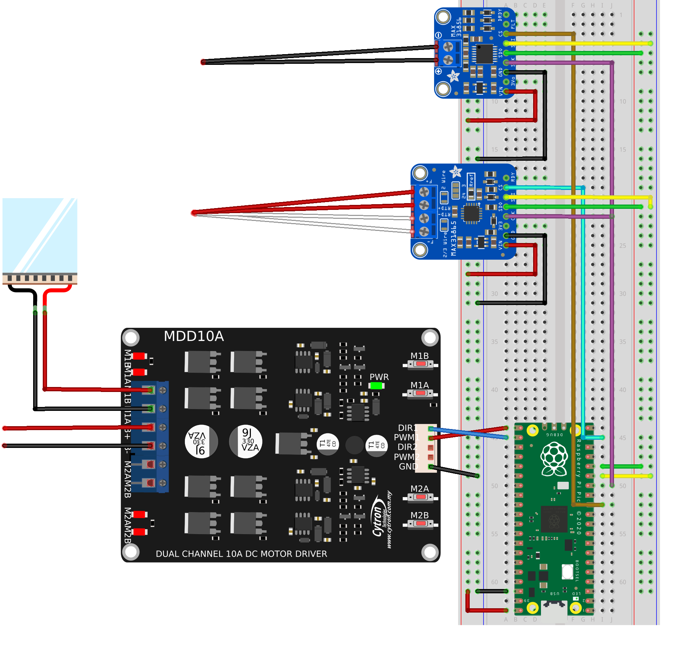

The unconnected red and black wires on the left-hand side of the diagram
should be connected to the positive and negative connections of the DC
power supply, respectively.

For the purposes of demonstrating temperature and heat control, the
thermocouple and RTD sensors can simply be attached directly to one of
the faces of the thermoelectric module. We will want to attach it to the
side that gets hot (the other side will cool down), which depends on the
direction of the current that drives it.

You can test this yourself, by using the buttons marked M1B and M1A. These
buttons allow the H-Bridge to be manually controlled, with one button
providing forward current and the other reverse current.

Pressing down M1A, you should find that one side of the TEM heats up, whilst
the other side cools down. With M1B pressed down instead, you should find
the sides are now reversed i.e the previously hot side is now cold and the
previously cold side now hot etc.

For the MAX31865 amplifier board, you may need to short some of the solder
bridges arranged on the board, depending on the number of wires used for
your RTD sensor. You can find more information about this in the Adafruit
`online instructions <https://learn.adafruit.com/adafruit-max31865-rtd-pt100-amplifier/rtd-wiring-config>`_.

Software setup
--------------

With Thonny and a suitable serial communication application installed, you
should open Thonny up, which should look somewhat similar to the picture below:

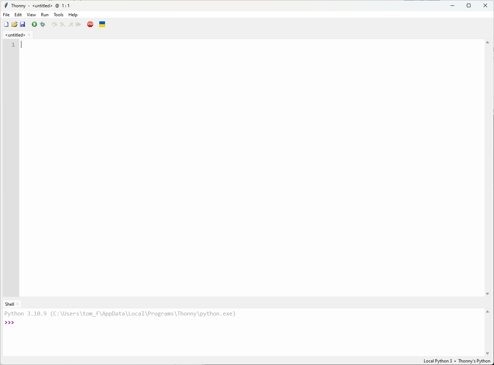

We can see in the bottom right hand corner that the current *interpreter* is
configured to the local Python 3 installation on the computer. We therefore
need to change this to the CircuitPython interpreter, that is on the Pico.
With the Pico plugged into the computer via the USB connection, left-clicking
the interpreter in the bottom right-hand corner should result in the following
menu, from which you should select CircuitPython:

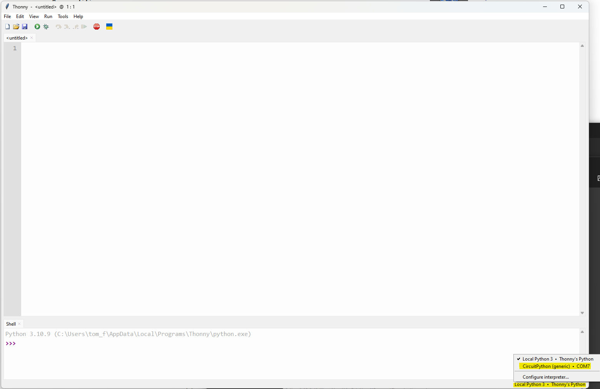
   
Next, we will want to configure the user interface, to show the necessary
elements. You can do this by clicking the "View" menu, making sure that the
highlighted options are selected:

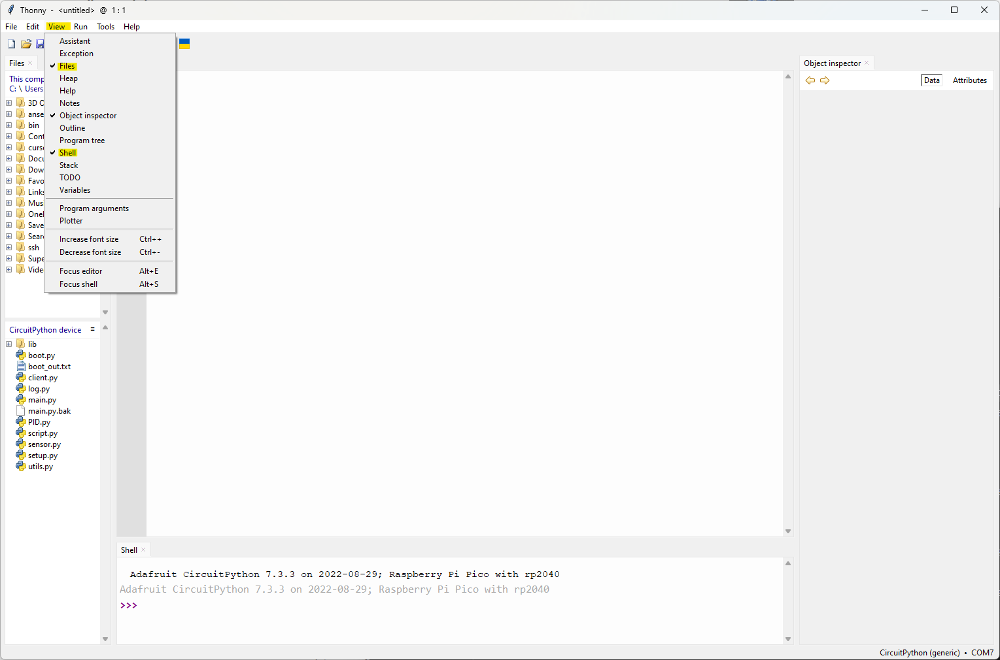
   
You will probably notice that the Files menu shows two filesystems, namely
that of the local computer, as well as that of the microcontroller. In order
to install the python code used for this example, you will need to navigate
to where the files are stored on your own computer, from which you should
be able to copy them to the microcontroller by right-clicking on them as
shown below:

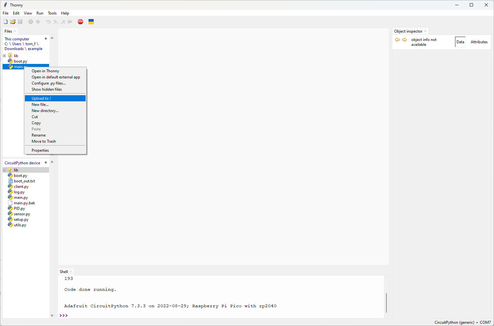
   
With the main.py and boot.py files, as well as the lib directory, copied to 
the Pico's filesystem, you can open the version of main.py installed on the
Pico by double clicking it.
   
Inspecting the program
----------------------

Upon opening main.py, you should see an approximately 450 line python
program, which has been divided into headered sections by the inline
comments.

The first 140 lines of code largely consist of boiler-plate code, such as
pin definitions, module imports and setting up periperhal devices.

Lines 10-13 import the basic interal Circuitpython libraries that are
required for measuring time, accessing board peripherals (like GPIO pins)
and buses such as the I2C, I2S, SPI, UART buses etc.

Lines 24-100 involve the initialising of the SPI devices, which in this
case, are the MAX31865 and '56 breakout boards. If you lookup a pinout
of the Pico, you will see that the pin definitions specified in lines 33-35
match the pins used in the wiring diagram shown earlier.

Between lines 52 to 100, the python objects used to model the two breakout boards
are initalised, :pyc:`max31865` and :pyc:`max31856`.

Temperature sensors
###################

We can get a better understanding of these objects by running the program and
inspecting them in the object inspector. Press the green "Run" button, to
run main.py and then type :pyc:`max31865` in shell prompt, hitting enter.

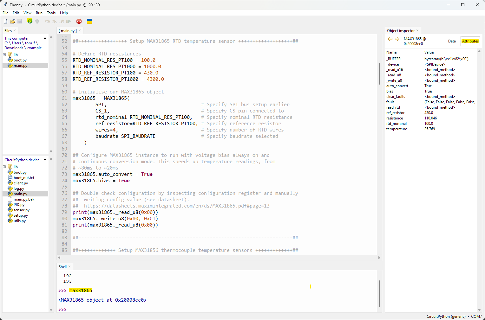
   
You should notice a new object appear in the Object inspector view. Clicking
on the Attributes tab will display the class features of the :pyc:`max31865`
object, including its attributes and methods. You will probably notice that
the value of some attributes, such as :pyc:`ref_resistor` and :pyc:`rtd_nominal` 
match those specified in the object's constructor.

Now try entering :pyc:`max31865.temperature` in the shell prompt and pressing
enter. This should return the current temperature detected by the board. You
should notice that when touching the RTD sensor, the temperature goes up.

PWM and DIR pins
################

Lines 115-136 involve the setup of the pulse-width modulation and logic output
pins, used to control the H-Bridge.

Once again, looking at the pin definitions, you will see that they match that
of the wiring schematic shown above.

Two pins are used to control a single thermoelectric module:

- The PWM pin controls the *amount* of current provided by the H-Bridge to the
  thermoelectric module. It does this by rapidly toggling on and off, at a
  relatively high frequency. The amount of time that the pin is LOW, relative
  to the amount of time that it is HIGH, determines the amount of current
  delivered - a value that is referred to as the *duty cycle*. For example,
  if the pin is high 70% of the time and low 30% of the time, it has a duty
  cycle of 70% and 70% of the maximum current will be provided to the TEM.
- The DIR pin controls the *direction* of the current flow through the TEM.
  When the DIR pin is HIGH, current will flow one way through the TEM; when
  it is LOW, the current will flow in the opposite direction.

Once again, you can test these ideas, by typing :pyc:`enPin1` into the
shell prompt. In the object inspector you should see a PWMOut object,
with a :pyc:`duty_cycle` attribute.

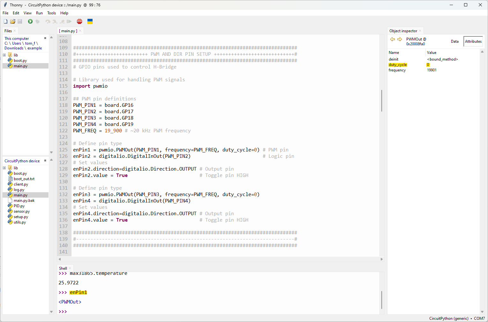
   
Try changing this, by entering :pyc:`enPin1.duty_cycle = 16383` in the shell
prompt. Do you notice anything happening with the TEM? Now try modifying the
value of the direction pin, by entering :pyc:`enPin2.value = False`. Once again,
you should notice a change in the response of the TEM.

Serial communications
#####################

The reference `documentation <https://tomfahey.github.io/DTA-MSc-Project/reference/micro-software.html>`_ 
for the microcontroller software describes the background behind the
communication between the MCU and software running on the
Raspberry Pi. 

This communication is carried out over a *serial connection*, which is a
basic way for low-power devices to exchange information, typically in
the form of byte-encoded strings. 

The actual transport medium for the serial communication between the
MCU and Raspberry Pi in this case is the USB connection. The Rasperry Pi
Pico is capable of using a USB standard called USB-CDC, which allows it
to emulate a serial port on the connected computer, appearing as a virtual
COM port.

On Windows, this can be seen in the Device Manager, as entries under the
Ports (COM & LPT) heading, as in the picture below:

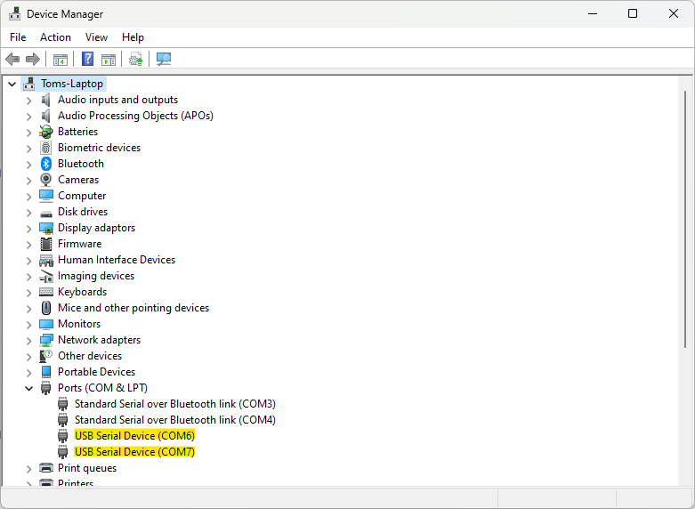
   
We can see that two serial devices are listed, COM6 and COM7. Looing back
at the earlier figure, where we selected the CircuitPython interpreter, you
will notice that this was COM7. Indeed, in CircuitPython, normally only one
COM port would appear on the computer - the one associated with
the REPL shell that we've been using in Thonny.

If you open the file :pyc:`boot.py`, you will notice that it contains an
import statement for the CircuitPython :pyc:`usb_cdc` library, as well as
a function call featuring that library, on line 9. Inside the function
argument, both of the parameters, :pyc:`console` and :pyc:`data` are set
as :pyc:`True`. By default, only the former is normally enabled, providing
the REPL prompt. By enabling :pyc:`data`, we get an extra serial channel,
which can be used to pass messages from the computer to the Pico and vice
versa.

Let's try this this out. If you haven't already, press the red "STOP"
button in the Thonny interface to restart the Pico. This is necessary
because the :pyc:`boot.py` file is a special python file, that is
executed when the Pico initially boots. Therefore, even if you've copied
it to the Pico's filesystem, until the Pico reboots, it won't have any
effect. Upon rebooting, press the green "Run" button again to execute
:pyc:`main.py`

You should now see two USB serial devices listed in Device Manager under
different COM ports, where one matches that used by the interpreter in
Thonny and the other does not.

Now open the application PuTTY. You should see something like the following:

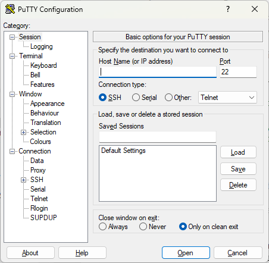
   
Change the connection type to Serial, entering the COM port that isn't
being used for the REPL interpreter and setting the "Speed" value to
115200:

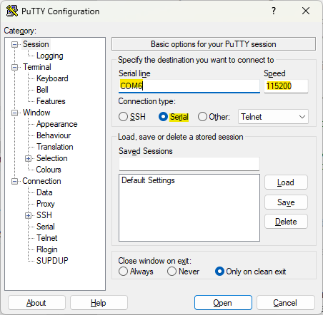
   
Now press "Open". You should see a black window appear similar to the
following:

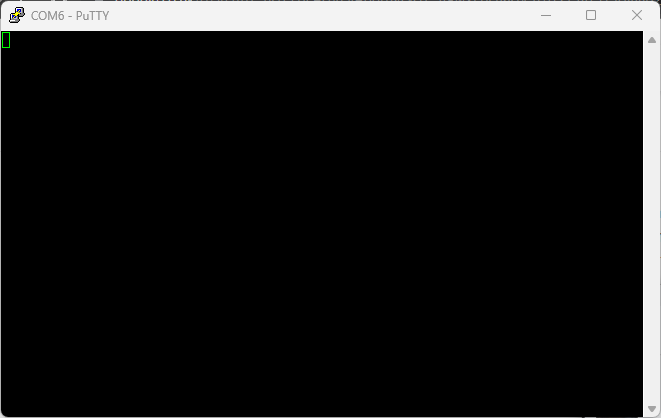
   
Going back to Thonny, enter the following code in the interpreter shell:

.. code-block:: python
   
   >>> serial.write(b'Hello, World!\n')
   
Looking in the PuTTY window, you should notice that the following text
is now present:

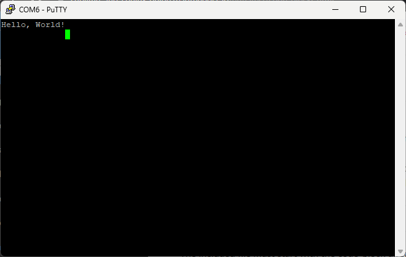
   
Now, right click the top of the PuTTY window
and select "Change Settings". Select the category "Terminal", then set
the options "Local echo" and "Local line editing" to "Force on", before
clicking "Apply":

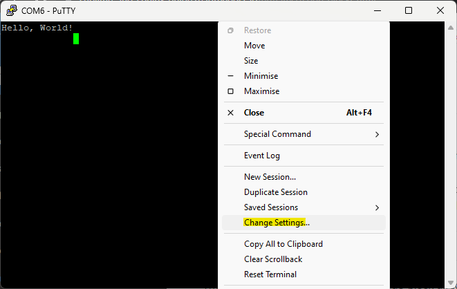
   

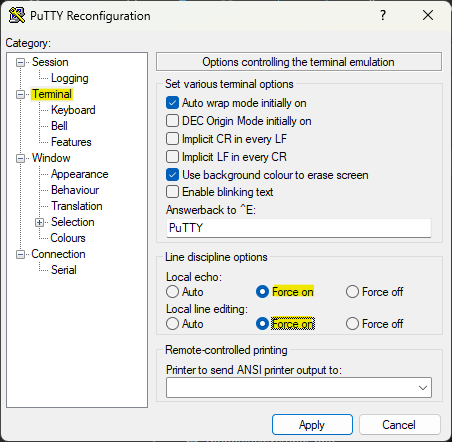
   
Now, try typing "Goodbye, World!" into the **PuTTY** window, then press
Enter on your keyboard:

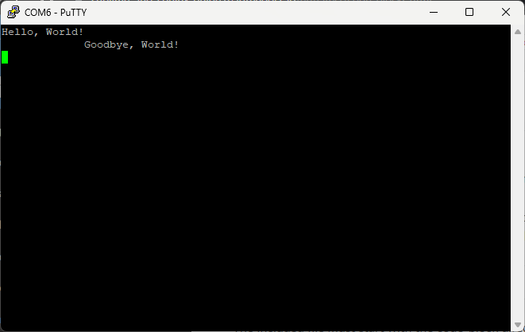
   
Going back to Thonny, now type into the REPL prompt:

.. code-block:: python
   
   >>> serial.readline()

You should see the following message:

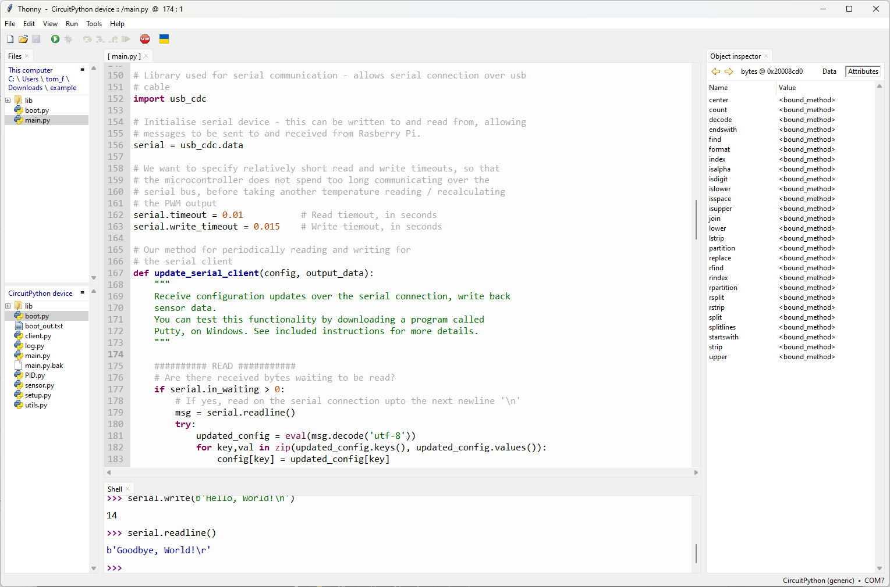
   
Putting it all together
-----------------------

By now, you've basically seen all of the core library functions used to
control the the MCU, when it interacts with the other system components,
such as the temperature sensors, H-Bridge and Raspberry Pi. 

The remainder of the code, from line 167 onwards, simply utilises these
library functions in an organised manner, such that the individual, simple 
interactions come together to achieve more sophisticated behaviour.

To demonstrate this, try calling the function :pyc:`main.py`, in the REPL
prompt:

.. code-block:: python

   >>> main()
   
You should see a stream of messages printing out to the REPL shell, similar
to the following:

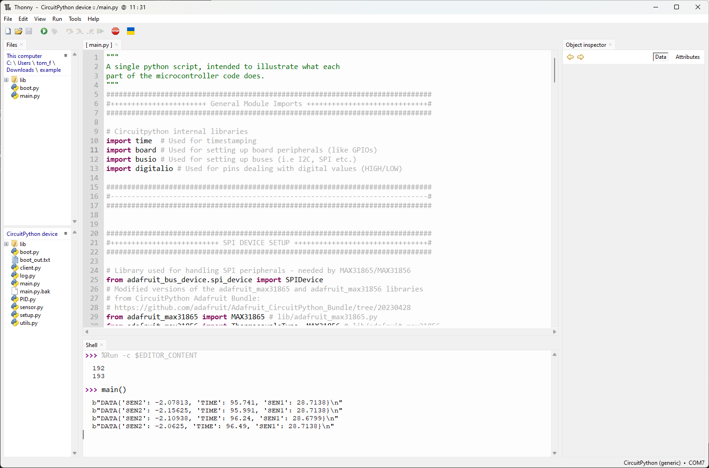
   
Can you notice anything about the timestamps - in particular, the time
difference between each one?

Try looking at the function definition of :pyc:`main.py`, in lines 383-392.
In the function argument, a default argument is specified, consisting
of a python dictionary called :pyc:`config`:

.. code-block:: python
   :lineno-start: 383

   def main(
      config={
        'RUN'       : False,  # Start heating run
        'MODE'      : False,  # Switch between heat ramp / temperature hold
        'LOG'       : False,  # Start time-stamping
        'TARGET'    : 23,     # Target heat rate / hold temperature
        'KP'        : 35.0,   # PID proportional gain constant
        'KD'        : 2.0,    # PID derivative gain constant
        'KI'        : 3.5,    # PID integral gain constant
        'INTERVAL'  : 0.25    # Time interval between readings
   )
   
Can you see anything interesting about the dictionary element :pyc:`'INTERVAL'`?
Now, going back to the PuTTY window, try typing in the following

.. code-block:: python

   {'INTERVAL':2}

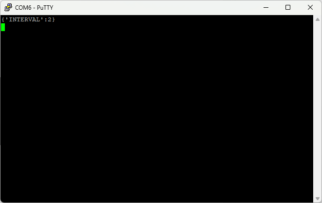
   
and hit Return on your keyboard. What do you notice now about the messages
printing to the REPL?

You might want to try entering different commands in the Putty window -
however you should take care whenever enabling any options that will
result in the TEM heating up:

The config value :pyc:`'MODE'` specifies whether the PID control loop will
attempt to maintain a constant temperature (in degrees Celsius) or a constant 
heat rate (in degrees Celsius per minute).

The config value :pyc:`'TARGET'` is used in **both** cases, to specify either
the set point temperature, or set point heat rate. Therefore, you will see 
a big difference in the TEM's response, depending on the value of :pyc:`'MODE'`,
when setting the value of :pyc:`'TARGET'` to say:

.. code-block:: python

   {'TARGET':55}

If the value of :pyc:`{'MODE:False'}`, the TEM should heat the hot side until
it detects that the attached temperature sensors have reached a temperature
of 55 degrees celsius, at which point it will attempt to maintain that
temperature.

However, if the value of :pyc:`{'MODE':True}`, the TEM will attempt to heat 
the hot side at a rate of 55 degrees Celsius per minute, which is almost a
degree per second. Not only will this result in dangerous temperatures for
contact with skin in less than a minute, but the microcontroller will
attempt to constantly maintain that heat rate, up to a 100% duty cycle. 

For DC power supplies with current supplies greater than 2 Amps, this can
lead to thermoelectrc modules heating up to 120-150 degrees Celsius before they
self-destruct, due to the internal solder melting.

Therefore, care should be taken when experimenting, and it would be a good
idea to not power the TEMs for longer than a couple minutes at most.

   

