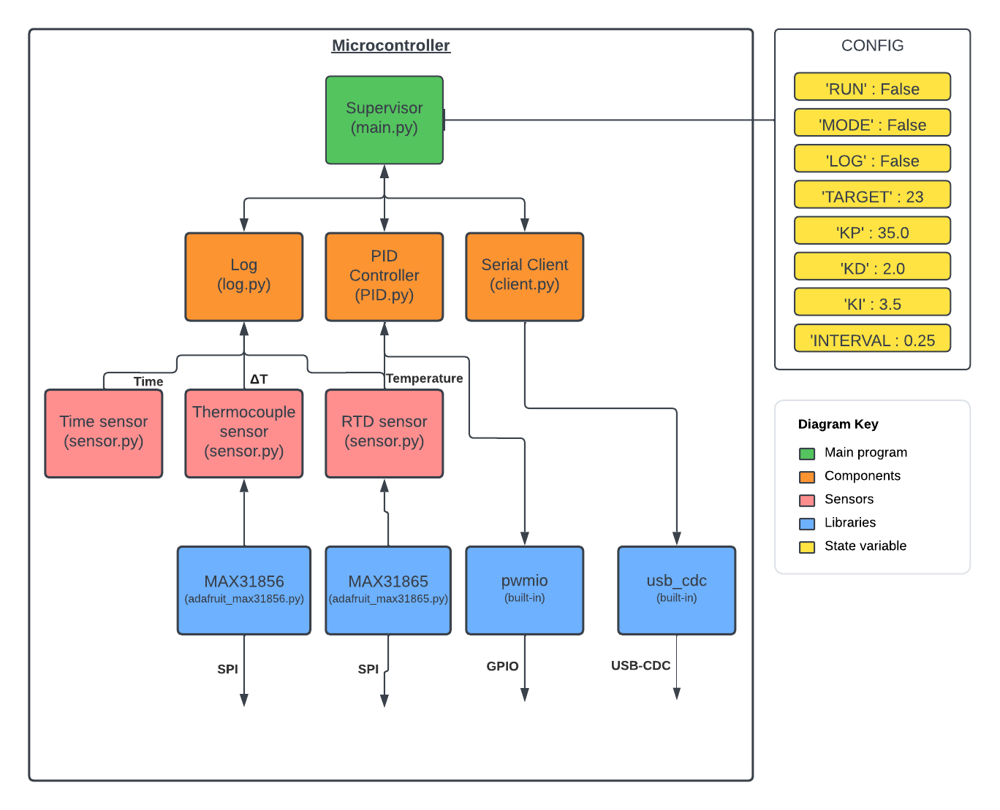

Microcontroller software reference
==================================

.. _ref_micro_overview:

Overview
--------

In line with the project aim to provide a python-based implementation
that is relevant to a wide audience, the software developed for the
microcontroller uses 
`CircuitPython <https://docs.circuitpython.org/en/latest/README.html>`_, 
a derivative of 
`MicroPython <https://docs.micropython.org/en/latest/>`_`.

The reason for adopting CircuitPython over MicroPython was its built-in support
for USB-CDC. This feature allows a microcontroller that is connected to a 
computer via USB to simultaneously provide serial communication between the
python code running on the microcontroller and computer, in addition to
mass storage, allowing the microcontroller's python code to be updated easily.

In combination with the MicroPython REPL prompt, this provides a very user
friendly, familiar environment for Python programmers to engage in microcontroller
programming.
  
.. _ref_micro_structure:

Structure
---------

The basic structure of the microcontroller python code is illustrated below:

Main programme
^^^^^^^^^^^^^^

.. toctree::
   :maxdepth: 2

   micro/main

   |

Components
^^^^^^^^^^

.. toctree::
   :maxdepth: 2

   micro/client
   micro/log
   micro/PID

   |

Wrapper classes 
^^^^^^^^^^^^^^^

.. toctree::
   :maxdepth: 2

   micro/sensor

   |

Utilities
^^^^^^^^^

.. toctree::
   :maxdepth: 2

   micro/boot
   micro/setup
   micro/utils

