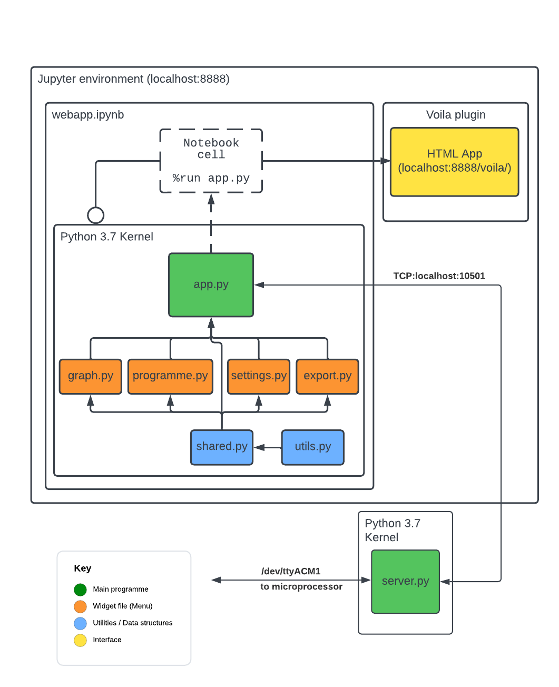

Dashboard (UI) software reference
=================================

.. _ref_ui_overview:

Overview
--------

As previously mentioned in the the :ref:`<basic>` section, the dashboard-style user interface for the system
is built using a `widget <https://ipywidgets.readthedocs.io/en/stable/>`_ based approach, that relies on the
Jupyter interactive computing platform.

This approach was chosen for the following reasons:

* As a Python-based project, the Jupyter platform is a natural fit, providing a popular and well-documented
  Python environment that is capable of producing rich, interactive, web-based visualisations, using libraries
  and tools which many undergraduates that are familiar with Python, will already be familiar with.
* Modern web browsers provide 

  
.. _ref_ui_structure:

Structure
---------

The underlying Python code for the dashboard application is composed of two main types of files:

* **Widget definition files**, largely composed of ipywidget object declarations, which define the *appearance* of 
  the user interface, in addition to some *local behaviour*, specific to the user elements defined within a given
  file.
* **Utility function files**, containing regular python code that defines useful functions/classes that are then 
  imported in widget definition files and used by the widget objects in them, to effect *global behaviour* of the
  user interface, such as handling of shared data and progression of the application state.

A 'top-level' script, :file:`app.py`, is then used to bring together the various UI elements defined in the
widget definition files, in a nesting/container-like manner, producing the final dashboard interface.

This approach introduces a great deal of flexibility, when it comes to implementing additional UI elements and
behaviours, as it is only necessary to create a new widget definition file (and accompanying utility function file,
if required), and then import that into the top-level script.

The present structure of the UI code includes the following files:

Widget definition files
^^^^^^^^^^^^^^^^^^^^^^^^

.. toctree::
   :maxdepth: 2

   webapp/graph
   webapp/programme
   webapp/settings
   webapp/export

Utility function files
^^^^^^^^^^^^^^^^^^^^^^

.. toctree::
   :maxdepth: 2

   webapp/shared
   webapp/utils

