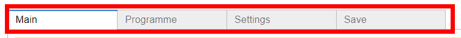
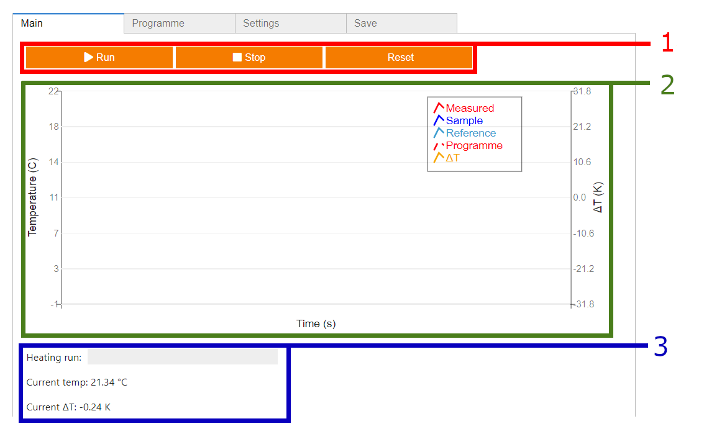
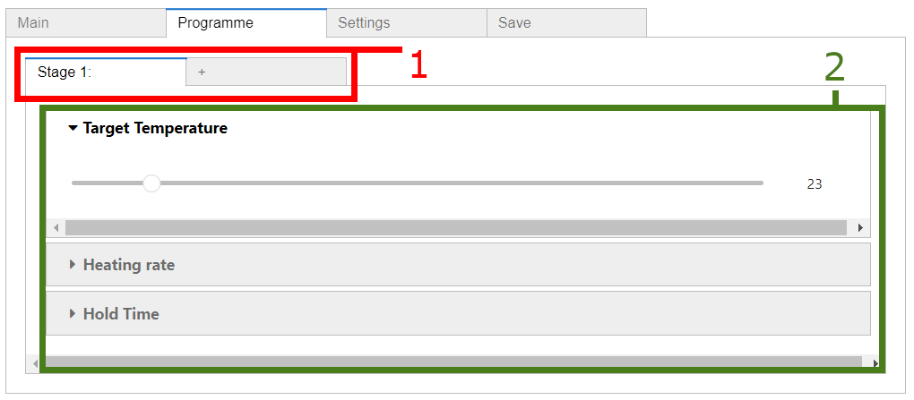
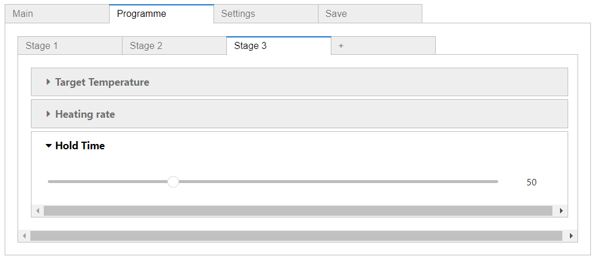
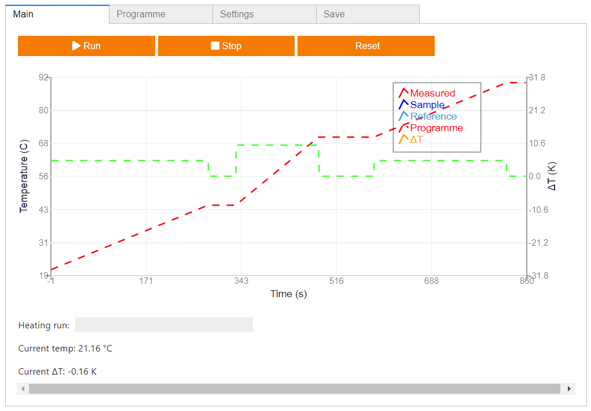
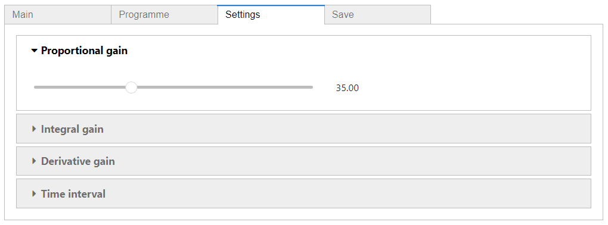
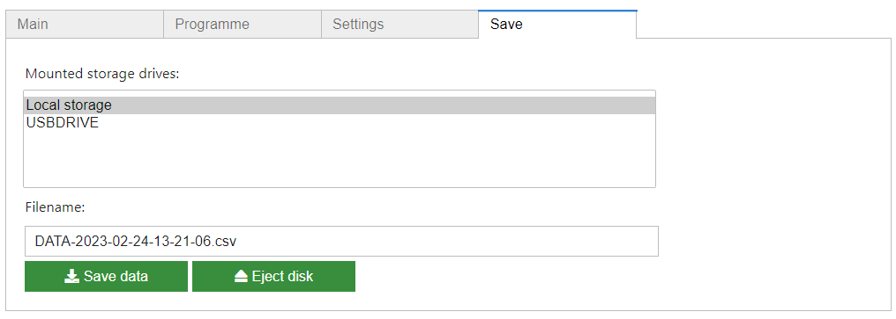

Basic Usage
===========

.. _web_app:

Background
------------

The user interface for the system is built using the `Jupyter Widgets <https://ipywidgets.readthedocs.io/en/stable/>`_ 
interactive browser controls for `Jupyter notebooks <https://jupyter.org/>`_, using `voila <https://voila.readthedocs.io/en/stable/index.html>`_
to render the notebook as a web application. More details on this can be found in the :doc:`reference/software` section.

This automatically launches within the web browser, presenting the user interface on the touchscreen display.

.. _web_interface:

User Interface
--------------

.. jupyter-execute::
    :hide-code:

    import os
    import sys

    ROOT_DIR = os.path.abspath('../')
    WEBAPP_PATH = ROOT_DIR + '/src/dashboard/'
    sys.path.insert(0, WEBAPP_PATH)

    from app import *

The user interface is presented as a series of navigable tabs, which
are accessed by the tab bar at the top.

Each tab provides a different set of widgets for either controlling or
configuring the system.

.. _web_interface_main:

Main tab
^^^^^^^^

.. figure:: ../images/UserInterfaceMainRun.png
   :align: center
   :scale: 50%
   :alt: Web app interface

The main tab features the following user interface elements:

1. The control bar, which is used for initiating
   and (manually) stopping heating runs, as well as clearing any currently saved data
   and the current heating programme.
2. The graph figure, which is used to display a preview of the entered
   heating programme, as well as the temperature profile of the temperature sensors when
   a heating run is in progress.
3. The status bar, which features a real-time readout of the
   system temperature, as well as the progress of an active heating run.

Programme tab
^^^^^^^^^^^^^

The programme tab features the following user interface elements:

1. List of programme *stages*. A *stage* consists of a temperature ramp,
   from the previous stage's *target temperature*, to that of the current
   stage. This ramp is carried out at the specified *heating rate*. Once
   the target temperature is reached, the system will maintain this for The
   specified 'hold time', before moving onto the next stage. Additional stages
   can be added by clicking the '+' button, with multiple stages making up the
   heating *programme*.
2. Drop-down sliders, for selecting the *target temperature*, *heating rate*
   and *hold time* for the current stage. Heating rate should always be non-zero.
   For cooling, a positive heating rate is entered, with a target temperature lower
   than that of the previous stage.

After setting up a heating programme, a preview of the programme is
displayed in the graph figure of the main tab.

Settings tab
^^^^^^^^^^^^

The settings tab features a number of drop-down sliders, for setting The
following system parameters:

* PID tuning parameters for the temperature control loop. The temperature
  control loop is implemented using a PID controller, the parameters of
  which can be tuned here, to achieve the desired temperature response.
  The ideal values of the parameters will vary, depending on the details of
  the thermal setup of the system, such as the current-voltage response of the 
  thermoelectric module used.
* The microcontroller tick rate. This is the rate at which the temperature sensors
  are sampled, and the PID controller updated. The default value of 0.25s is recommended.

Export tab
^^^^^^^^^^

   The export tab is used for saving temperature data after a heating run. 
   When a heating run is finished, the recorded data is stored, after which
   the system will revert to the idle state. To save the recorded data of a
   run, the user should specify a filename and storage location in the export
   tab, and click the 'Save' button

..
   Creating recipes
   ----------------
   
   To retrieve a list of random ingredients,
   you can use the ``lumache.get_random_ingredients()`` function:
   
   .. autofunction:: lumache.get_random_ingredients
   
   The ``kind`` parameter should be either ``"meat"``, ``"fish"``,
   or ``"veggies"``. Otherwise, :autofunction`lumache.get_random_ingredients`
   will raise an exception.
   
   .. autoexception:: lumache.InvalidKindError
   
   >>> import lumache
   >>> lumache.get_random_ingredients()
   ['shells', 'gorgonzola', 'parsley']